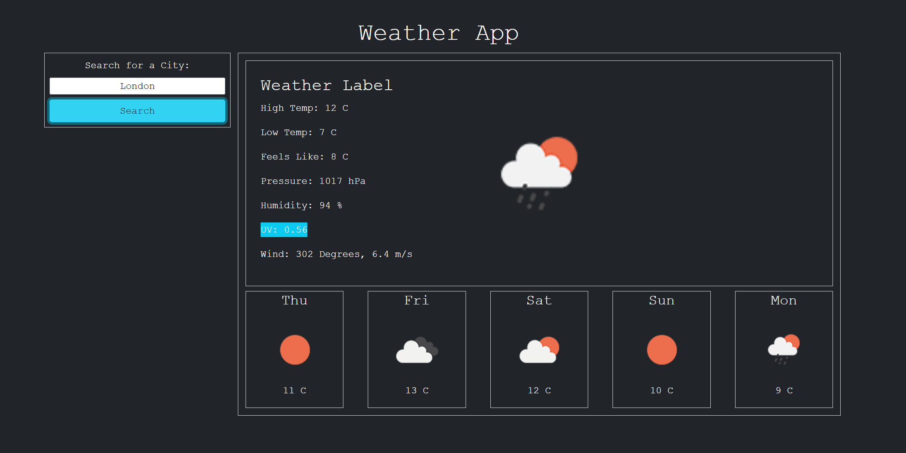

# WEATHER DASHBOARD
A weather dashboard to display current weather information and 5 day forecast

##### screenshot of app

 
### CREATED WITH:
* HTML
* CSS
* Javascript
* JQuery
* Bootstrap

### TASKS

- [X] get input from user  
- [X] set search to local storage  
- [X] create getLocalStorage for preload  
- [_] list prior searches  
- [X] api call for lat/long position  
- [X] input lat/long to api call for weather  
- [X] update weather divs 
- [X] images that update for time/weather 

### Optional:
- [_] update time of day to reflect weather 
- [_] animations? 

https://api.openweathermap.org/data/2.5/onecall?lat=40.71&lon=-74.01&units=metric&appid=b5160f6261b60ed2e93a3754a8a382bc